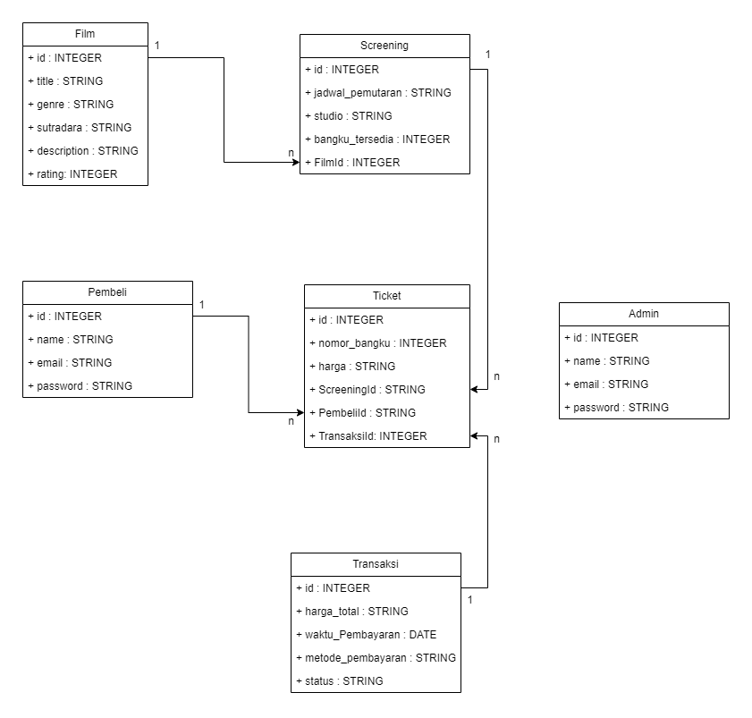
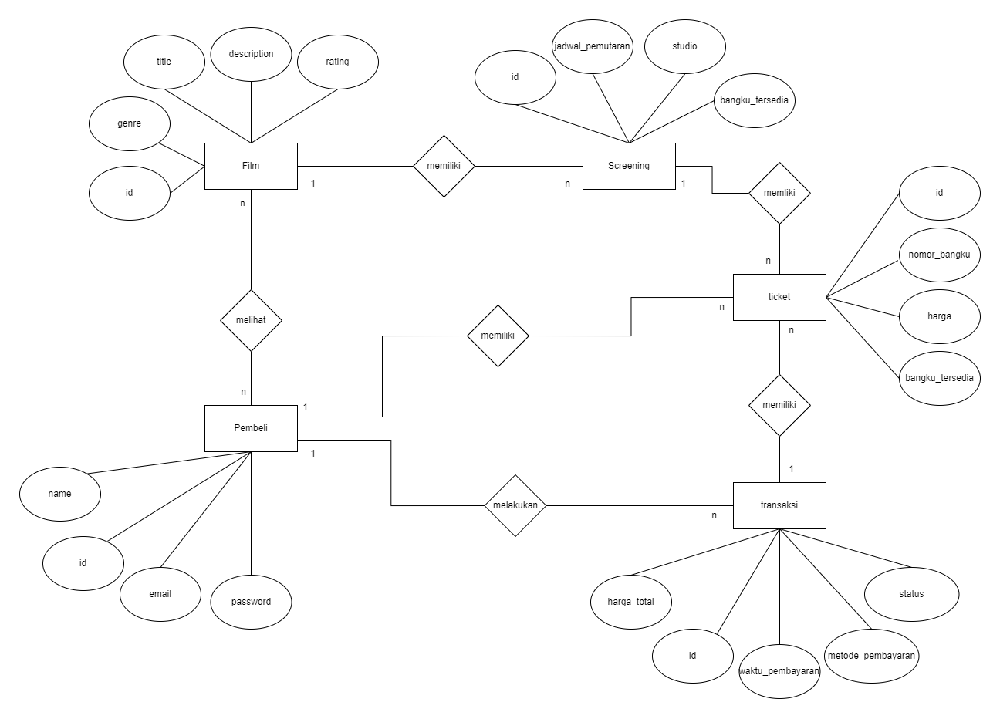

# RESTFULL API KELOLA TICKETING FILM

## Deskripsi Projek

rest full api yang digunakan untuk kelola sistem ticketing bioskop, menggunakan Sequelize sebagai ORM untuk mengelola database dengan struktur Model-View-Controller (MVC).

## Teknologi yang digunakan

1. **express**

    cara install
    ```
    npm install express
    ```

2. **mysql**

     cara install
    ```
    npm install mysql2
    ```
3. **dotenv**
 cara install
    ```
    npm install dotenv
    ```

4. **sequelize**
 cara install
    ```
    npm install sequelize
    ```

5. **nodemon**
 cara install (global)
    ```
    npm install -g nodemon
    ```

6. **body-parser**
 cara install
    ```
    npm i body-parser
    ```

## class diagram



## ERD


## Relasi Aantar Table


## ``` nama : Pajri Aria Dana ```
## ``` kelas : XII PPLG ```
## ``` instagram : @troverint ```